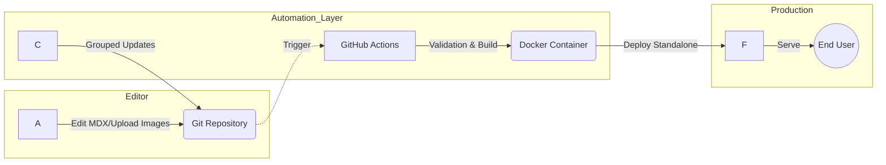

# 🚀 The Self-Maintaining Developer Portfolio (v4.0)

A high-performance, modular portfolio system designed to eliminate **"Portfolio Rot."** This project treats GitHub as a Headless CMS, allowing you to manage content entirely in the browser while automated robots handle the tech stack maintenance.

---

## 1. System Architecture

This system uses a **Serverless, Decoupled Architecture**. Content (MDX) and assets are separated from the application logic, allowing for interchangeable designs and automated infrastructure updates.

### 1.1 Technical Flow

### 1.2 Core Tech Stack

* **Framework:** Next.js 16.1 (App Router) — *Enforcing Async Request APIs*
* **Language:** TypeScript 5.9.3 (Strict Mode)
* **Styling:** Tailwind CSS v4.1 — *CSS-first configuration with Semantic Variables*
* **Content Engine:** Velite 0.1.8 — *Type-safe Zod schema validation for local files*
* **Theming:** next-themes — *Persistence for System/Dark/Light modes*
* **Deployment:** Google Cloud Run — *Dockerized standalone builds*

---

## 2. The "GitHub as CMS" Workflow

The primary innovation of this portfolio is the **browser-only editing model**. You never need to clone the repository to update your work.

### 2.1 The Pull Request (PR) Model

To ensure production stability, all content updates follow a strict validation pipeline:

1. **Branch:** Create a new branch in the GitHub UI.
2. **Assets:** Drag & drop images into `public/images/projects/`.
3. **Content:** Create/Edit `.mdx` files in `content/projects/`.
4. **Validate:** GitHub Actions runs `npx velite validate` and a **Link Checker**.
5. **Merge:** Once the "Green Check" appears, merge the PR. The site updates automatically.

### 2.2 Asset Strategy

Images are stored in the `/public` folder to allow **real-time previews** inside the GitHub Markdown editor.

* **Optimization:** A custom `MDXImage` component intercepts standard Markdown `!()` tags.
* **Stability:** Containers use `aspect-video` (16:9) to prevent **Cumulative Layout Shift (CLS)**, ensuring a 95+ Lighthouse performance score.

---

## 3. Project Structure & Modular Design

The frontend is a **LEGO-style "Block System"**. Layouts are assembled by stacking components in `app/page.tsx`.

### 3.1 Directory Overview

├── app/                  # Next.js App Router (Server Components)
├── components/
│   ├── blocks/           # Content-aware sections (HeroCard, StackCard)
│   ├── ui/               # Primitive elements (Buttons, Badges via Shadcn)
│   └── mdx-components.tsx # Custom logic for Markdown rendering
├── config/
│   └── site.ts           # Global Identity & Navigation Config
├── content/              # MDX Database (Projects, Testimonials, Pages)
└── public/images/        # Managed Media Library

### 3.2 Composable Sections

Sections are "Smart Blocks" that accept display props:

* **`<Hero />`**: Supports `simple`, `bento`, or `split` variants.
* **`<LatestProject />`**: Automatically fetches the most recent project from Velite.
* **`<Testimonials />`**: Consumes a single `testimonials.yml` list for zero-friction editing.

---

## 4. Automated Maintenance

This portfolio is designed to be **"Self-Driving."** It uses a tiered automation strategy to stay secure and modern without manual intervention.

1. **Grouped Updates:** Dependabot checks for updates weekly.
2. **Tiered Auto-Merge:**
* **Safe Updates:** (Linters, Types, Patches) are merged automatically if the build passes.
* **Risky Updates:** (Next.js, React, Tailwind) require manual approval via Vercel Deploy Previews.

3. **Content Guardrails:** CI scripts verify that no image paths are broken and all required frontmatter fields (slugs, dates) exist.

---

## 5. Deployment (Google Cloud Run)

The application is containerized for the **Google "New Year, New You" Challenge**.

### 5.1 Docker Configuration

The `Dockerfile` uses a multi-stage build to output a **Standalone Node.js server**, minimizing the final image size for faster cold starts on the Cloud Run free tier.

### 5.2 Deployment Steps

1. Enable **Continuous Deployment** in the Google Cloud Console.
2. Select **Cloud Build** as the trigger source.
3. Select **Dockerfile** as the build type.
4. Set Authentication to **"Allow unauthenticated invocations"** for public access.

---

## 6. How to Use this Template

1. **Fork** this repository.
2. Update `config/site.ts` with your details.
3. Replace `public/avatar.jpg` with your headshot.
4. Start adding projects via the **GitHub Web UI**.

---

## 7. License

Licensed under the(LICENSE). Feel free to "riff" and build your own.

---

